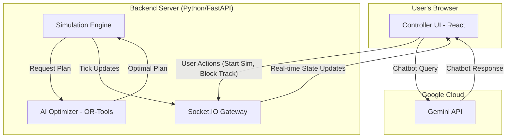
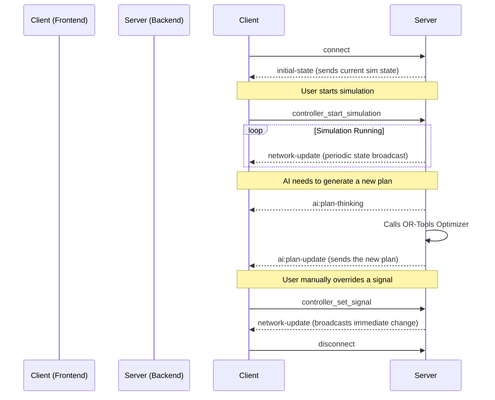
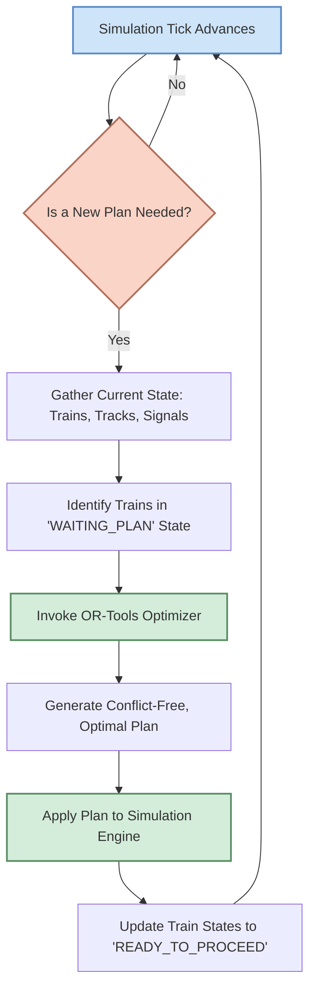

# <p align="center">🚄 FlowState-Rail</p>

<p align="center">
  <i>An Intelligent, Real-Time Decision Support System for the Future of Railway Traffic Control.</i>
</p>

<p align="center">
  
</p>

<p align="center">
    
    
    
    
</p>

---

## 📖 Table of Contents

- [About The Project](#about-the-project)
- [✨ Key Features](#-key-features)
- [🛠️ Technology Stack](#️-technology-stack)
- [🚀 Getting Started](#-getting-started)
  - [Prerequisites](#prerequisites)
  - [Installation](#installation)
  - [Configuration](#configuration)
- [🕹️ Usage](#️-usage)
- [🏛️ System Architecture](#️-system-architecture)
- [📜 License](#-license)
- [🤝 Acknowledgements](#-acknowledgements)

---

## 🌟 About The Project

**FlowState-Rail** is a next-generation command and control console designed to tackle the immense combinatorial complexity of modern railway networks. As traffic volumes on networks like the Indian Railways grow, traditional manual control methods become a bottleneck, leading to delays, reduced throughput, and cascading failures during disruptions.

This project introduces an intelligent, data-driven decision-support system that empowers human controllers. By combining the mathematical precision of **Google OR-Tools** for optimization with the advanced reasoning of **Google's Gemini API**, FlowState-Rail provides real-time, conflict-free routing solutions, predictive analytics, and an intuitive, interactive interface.

> Our mission is to enhance operational efficiency, improve punctuality, and maximize the utilization of existing railway infrastructure through a seamless fusion of human expertise and artificial intelligence.

This simulation environment models a complete railway section, allowing controllers to run what-if scenarios, manage live disruptions, and receive intelligent recommendations, all from a single, unified dashboard.

---

## 🔹 Key Features

- **🧠 AI-Powered Route Optimization**  
  Leverages a Python backend with **Google OR-Tools** to solve complex routing and scheduling problems, reducing delays and preventing track conflicts through intelligent optimization.

- **🌐 Real-Time Network Visualization**  
  An interactive **SVG-based track diagram** built with **React**, displaying live train positions, signal states, and track occupancy in real time.

- **🕹️ Full Simulation Control**  
  Supports complete control over the simulation lifecycle — **start, pause, stop, and accelerate** — enabling scenario testing and observation of AI-driven decisions under changing conditions.

- **✋ Human-in-the-Loop Architecture**  
  The AI suggests optimal actions, but the human controller retains full authority with **manual override** of signals and track assignments, ensuring safety and transparency.

- **🤖 Conversational AI Assistant**  
  An integrated chatbot powered by the **Gemini API** allows users to query the system in natural language and receive real-time insights about network status and train behavior.

- **⚙️ Dynamic AI Strategy Configuration**  
  Decision-making priorities can be adjusted on the fly, balancing factors such as:
  - Network congestion  
  - Train priority  
  - Punctuality  
  - Adverse weather conditions  

- **📊 Modular & Data-Driven Design**  
  New railway sections can be simulated easily by modifying:
  - Station layouts (`.json`)  
  - Train schedules (`.csv`)  
  This enables rapid testing of different network configurations.

- **💾 Persistent State Management**  
  The UI state is stored in **`sessionStorage`**, allowing page reloads without losing the current simulation context or configuration.

---

## 🛠️ Technology Stack

This project is a full-stack application with a clear separation of concerns between the frontend, backend simulation, and AI services.

### Frontend

- **Framework**: [React](https://reactjs.org/) 18.2
- **State Management**: React Hooks (useState, useEffect, etc.)
- **Real-Time Communication**: [Socket.IO Client](https://socket.io/docs/v4/client-api/)
- **UI/Animation**: [GSAP (GreenSock Animation Platform)](https://greensock.com/gsap/), Custom CSS
- **Visualization**: SVG for the track diagram
- **Icons**: [React Icons](https://react-icons.github.io/react-icons/) & [Lucide](https://lucide.dev/)

### Backend (Simulation & Optimization)

- **Framework**: [FastAPI](https://fastapi.tiangolo.com/)
- **Real-Time Communication**: [Python-SocketIO](https://python-socketio.readthedocs.io/)
- **Optimization Solver**: [Google OR-Tools (CP-SAT Solver)](https://developers.google.com/optimization)
- **Data Handling**: [Pandas](https://pandas.pydata.org/)
- **Language**: Python 3.11+

### AI Services (LLM-Powered Logic & Chat)

- **Generative AI**: [Google Gemini API](https://ai.google.dev/)
- **Runtime**: [Node.js](https://nodejs.org/) with Express
- **Real-Time Communication**: [Socket.IO](https://socket.io/) (for the JS-based engine variant)

---

## 🚀 Getting Started

To get a local copy up and running, follow these simple steps.

### Prerequisites

- **Python**: Version 3.11 or higher.
- **Node.js**: Version 18.x or higher.
- **Git**: To clone the repository.

### Installation

1.  **Clone the repository:**
    ```sh
    git clone https://github.com/your-username/FlowState-Rail.git
    cd FlowState-Rail
    ```

2.  **Setup the Python Backend:**
    ```sh
    # Navigate to the backend directory
    cd backend

    # Create and activate a virtual environment
    python -m venv venv
    source venv/bin/activate  # On Windows, use `venv\Scripts\activate`

    # Install the required Python packages
    pip install -r requirements.txt
    ```

3.  **Setup the React Frontend:**
    ```sh
    # Navigate to the frontend directory from the root
    cd frontend

    # Install NPM packages
    npm install
    ```

### Configuration

This project requires API keys for Google Gemini. You need to create `.env` files in both the `backend` and `frontend` directories.

1.  **Backend `.env` file:**
    -   Create a file named `.env` inside the `backend/` directory.
    -   Add your Gemini API key.

    **File: `backend/.env`**
    ```env
    GEMINI_API_KEY="YOUR_GEMINI_API_KEY_HERE"
    ```

2.  **Frontend `.env` file:**
    -   Create a file named `.env` inside the `frontend/` directory.
    -   Add any frontend-specific environment variables if needed (though none are required by default for the React app to run).

    **File: `frontend/.env`**
    ```env
    # React backend URL
    REACT_APP_API_URL="http://localhost:8001"
    ```

---

## 🕹️ Usage

You can launch both services with a single click or run them in separate terminals.

### Quick Start (Windows)
Double-click **`start_all.bat`** in the root directory. This will start both the backend on port 8001 and frontend on port 3000 in separate windows.

### Manual Start

1.  **Start the Python Backend Server:**
    -   Navigate to the `Backend/` directory.
    -   Run the FastAPI server using Uvicorn on port 8001:

    ```sh
    cd Backend
    python -m uvicorn main:socket_app --host 0.0.0.0 --port 8001 --reload
    ```
    - The server will be running at `http://localhost:8001`.

2.  **Start the React Frontend Application:**
    -   In a separate terminal, navigate to the `frontend/` directory.
    -   Run the development server:

    ```sh
    cd frontend
    npm start
    ```
    - The application will automatically open in your browser at `http://localhost:3000`.

You can now access the **HomePage** at `http://localhost:3000` and navigate to the `/dashboard` to use the Railway Section Controller.

---

## 🏛️ System Architecture

The application is architected around a real-time, event-driven model that ensures low latency between the controller's actions, the simulation's state, and the AI's decisions.

### High-Level System Architecture

This diagram shows the main components and how they interact. The **Controller UI (Frontend)** communicates exclusively with the **Backend Server (Python)** via WebSockets. The backend runs the core simulation and calls on the **AI Optimizer (OR-Tools)** to generate plans. Separately, the UI's chatbot feature makes direct calls to the **Gemini API** for natural language processing.



### Real-Time Data Flow (Socket.IO Events)

This diagram illustrates the primary WebSocket events that drive the application's real-time nature.



### AI Optimization Loop

This diagram details the core logic loop within the Python backend that is responsible for generating and applying optimized train routes.



---

## 📜 License

This project is distributed under the MIT License. See `LICENSE` for more information.

---

## 🤝 Acknowledgements

-   To the creators of the incredible open-source tools that made this project possible.
-   The Indian Railways community for providing the inspiration and complex challenges.
-   **Team Rose A** for their dedication and hard work.

---
